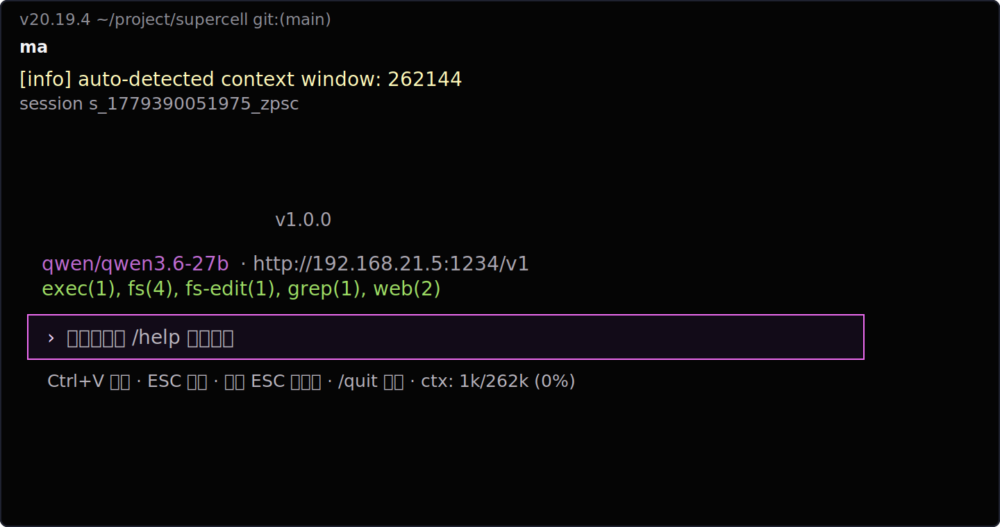
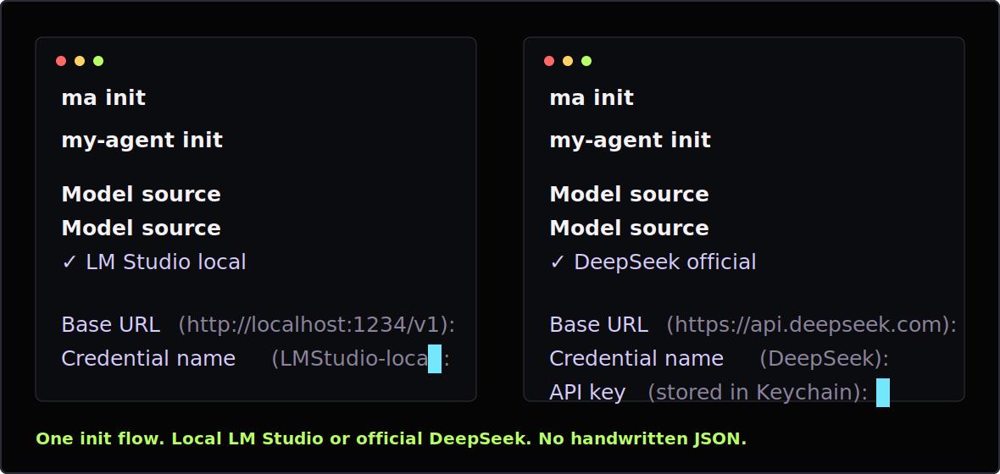

# MA

**English** | [中文](README.zh-CN.md)

DeepSeek in minutes. Local small models turned into real productivity.

MA is a terminal coding agent built around two practical promises: remote setup should be brainless, and local small models should become useful production tools. DeepSeek config is interactive and direct. LM Studio/Qwen gets long-context handling, tool hardening, model switching, and benchmark-driven fixes so small models can do real repo work.

`v0.2.0-alpha.1` supports LM Studio local models, DeepSeek official API, and Agora through MCP stdio. Agora is MA's local-first provider integration: it exposes real model-loading and MemoryPatch state instead of pretending memory was added to a prompt.

Website: https://zimoos.github.io/my-agent/

Release: https://github.com/zimoos/my-agent/releases/tag/v0.2.0-alpha.1

[Roadmap](ROADMAP.md) · [Changelog](CHANGELOG.md) · [Contributing](CONTRIBUTING.md) · [Discussions](https://github.com/zimoos/my-agent/discussions)





## The Hook

- **Local small models become productive**: MA's alpha gate runs 70 L0-L2 tasks through a local Qwen3-30B model via LM Studio.
- **DeepSeek is the zero-friction fallback**: `ma init` gives LM Studio and DeepSeek the same arrow-key setup flow, stores remote keys safely, and leaves you with a working profile instead of a config chore.
- **Near-infinite working room**: MA auto-detects context windows, tracks usage, compresses output, and is designed for long local-agent loops.
- **Small-model hardening is the product**: Qwen/LM Studio-specific sampling, image payload compatibility, tool-call recovery, and prompt/message integrity are treated as release gates.
- **Agent tools are built in**: shell, file read/write, structured edits, grep, and web are available immediately after init.

## Why MA Exists

Most terminal AI tools assume the hosted model is the product. MA assumes the workflow is the product: configure DeepSeek without thinking, then make local Qwen useful enough to keep running real tasks without worrying about token cost.

That means the product priorities are different:

- DeepSeek setup that writes a usable profile in one pass
- local model profiles instead of one global model string
- benchmark gates for local small-model productivity instead of vibe-only demos
- Keychain-backed secrets instead of plaintext API keys
- repo-local instructions, skills, and tool loops tuned for small models

## Benchmark

MA uses benchmark data as product evidence: local Qwen3-30B through LM Studio passes the alpha L0-L2 release gate.

| Model | Runtime | Tasks | L0 | L1 | L2 |
| --- | --- | ---: | ---: | ---: | ---: |
| Qwen3-30B local | LM Studio | 70 | 100% | 98.7% | 95.3% |

This benchmark is the proof point for the claim: local small models can become useful with enough agent-loop engineering. It covers connectivity, stable tool use, and multi-turn local project work. It is not a universal coding-agent leaderboard.

See [docs/benchmark-results.md](docs/benchmark-results.md).

## Install

### Portable bundle

Download the release asset for your platform:

- `ma-*-macos-arm64.tar.gz`
- `ma-*-linux-x64.tar.gz`
- `ma-*-windows-x64.zip`

macOS / Linux:

```bash
tar -xzf ma-*.tar.gz
cd ma-*
./ma init
./ma
```

Windows:

```powershell
Expand-Archive ma-*.zip
cd ma-*
.\ma.cmd init
.\ma.cmd
```

The portable bundle includes Node.js and production dependencies. No global Node or npm install is required.

### From source

```bash
git clone https://github.com/zimoos/my-agent.git
cd my-agent
npm install
npm run build
npm link
ma init
ma
```

## Quick Start

```bash
ma init
ma
```

During init:

1. Choose model source: LM Studio local or DeepSeek official.
2. Enter base URL if needed.
3. Enter API key for remote providers.
4. Pick a discovered model with arrow keys.

That means both first-run paths stay obvious:

```text
LM Studio local  -> Base URL -> credential name -> discovered local model
DeepSeek official -> Base URL -> credential name -> Keychain API key -> discovered DeepSeek model
```

Inside MA:

```text
/          show slash command suggestions
/model     switch model/profile with arrow keys
Tab        complete selected command
Enter      run selected slash command
ESC ESC    switch session
```

## Commands

User-facing slash commands:

| Command | Purpose |
| --- | --- |
| `/model` | Open the model/profile picker |
| `/help` | Show user-facing commands |
| `/clear` | Clear current conversation |
| `/exit` | Exit MA |

CLI commands:

```bash
ma                         # chat
ma chat --resume           # resume latest session
ma chat --resume <id>      # resume specific session
ma sessions                # list sessions
ma profiles                # list model profiles
ma profile use <profile>   # set default profile
ma secrets list            # list secure credentials
ma secrets view <id>       # view masked key after system auth
ma secrets delete <id>     # delete key after system auth
ma secrets repair <id>     # repair macOS Keychain trusted access
ma init                    # interactive setup
ma version
```

## Model Profiles

MA separates credentials from model profiles.

Example model ids:

```text
LMStudio-local/qwen/qwen3.6-27b
DeepSeek/deepseek-v4-flash
```

`/model` aggregates models from configured providers, prefixes them by credential/provider name, and remembers the last selected profile.

## Agora: Native Local Runtime and Memory

MA can run Agora as a provider-owned MCP stdio subprocess instead of asking users to manage a local HTTP server. The TUI reports real provider stages such as local-model loading, memory mounting, and generation.

When the active provider is Agora, MA can expose verified MemoryPatch operations: mount, disable, internalize, roll back, and inspect state. MA treats a memory module as active only after Agora returns matching response metadata; it never fakes memory by injecting facts into a prompt.

## Built-In Tools

MA starts with built-in MCP servers:

- `exec`: shell command execution with danger guard
- `fs`: file read/write
- `fs-edit`: structured file edits
- `grep`: code/text search
- `web`: DuckDuckGo search and web fetch with curl fallback

## Skills

Create `.ma/skills/deploy.md`:

```markdown
---
name: deploy
description: Deploy this project
arguments:
  - name: environment
    description: Target environment
    required: false
    default: staging
---

Deploy this project to {{environment}}.
Run tests first, build, deploy, then verify.
```

Use it:

```text
/deploy environment=production
```

Skills appear in slash command suggestions unless they conflict with a built-in command.

## Configuration

Global config:

```text
~/.my-agent/config.json
```

Project config:

```text
./config.json
```

Project config overrides global config. `AGENT.md` files are loaded from the current directory upward, plus `~/.my-agent/AGENT.md`.

## Security

MA can run shell commands and edit files. Use it in trusted workspaces.

Current safeguards:

- dangerous shell command confirmation
- macOS Keychain for remote API keys
- explicit `ma secrets view/delete` authentication
- session-local runtime secret loading for unattended agent work

Known alpha boundary: the current Keychain helper is good enough for local alpha use, but stricter process-level trust would require a signed helper/ACL design.

## Development

```bash
npm run dev
npm test
npm run build
npm run release:check
```

See [CHANGELOG.md](CHANGELOG.md) for unreleased reliability work and [ROADMAP.md](ROADMAP.md) for the public product direction.

## Community

- Read [CONTRIBUTING.md](CONTRIBUTING.md) before opening a pull request.
- Report vulnerabilities privately under [SECURITY.md](SECURITY.md), not in a public issue.
- Discussions are enabled for questions, ideas, and model/runtime reports.

## License

MA is released under the [MIT License](LICENSE). You may use, modify, distribute, sublicense, and sell copies of MA, provided that the copyright and license notice are retained.
